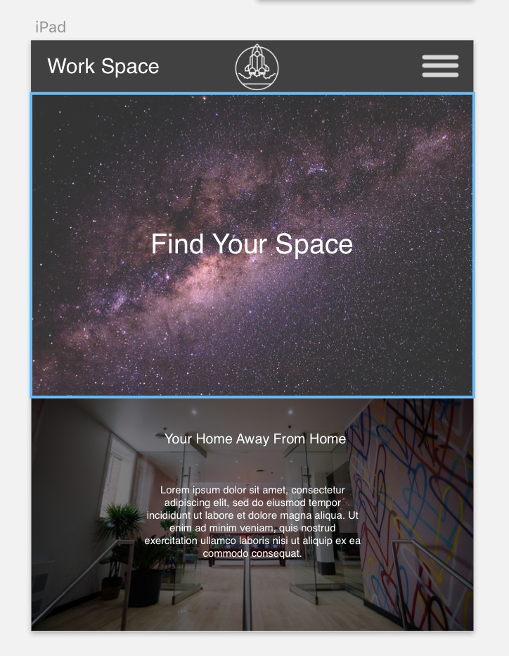

# 2 Week Freelance Project

This is a mock project replicating the full design process for creating a site as a freelance developer for a non-technically inclined client.

## Getting Started

* visit https://github.com/dmonarrez/freelance.git
* Clone the repo to your computer.
* Launch the local file

## Description

The site is to showcase a new co-working space in the city and entice new people to join and choose this space as their working environment.

## Target Users

* Programmers
* Writers
* Photographers
* Online tutors/educators
* Data Entry Workers
* Marketing and PR Consultants
* Other freelance/remote professionals

making a change so that i can make a commit

## User Stories

#### Angela (Graphic Designer)

###### Needs
* See membership options
* Online registration
* Contact support if questions arise
* Minimal distractions

###### Pain Points
* Overwhelming environment
* Not enough amenities
* Unfriendly/rude people

###### How we can serve
* Provide a peaceful environment
* Membership options are clear and easy to access
* Provide multiple coffee makers/refrigerators etc.

###### User Stories

* As a graphic designer, I want to be able to be in a space where I can focus on my project with minimal distractions from the people around me
* As a remote professional, I want to be able to do most (if not all) of my set up for the space online
* As a member of the space, I want to be able to contact people associated with the space if I have any problems or questions.
* As someone in the market for a co-working space, I want to be able to see layouts and pricing without having to sign up or register to compare and contrast

#### Jordan (Marketing Consultant)

###### Needs
* Space options for meetings
* know when/if rooms are booked or available
* Welcoming environment for new people

###### Pain Points
* Lack of option descriptions and pictures
* No mobile support for booking space/rooms

###### How we can serve
* Allow all booking on mobile
* Provide a live schedule of room/space availability

###### User Stories

* As a Marketing Consultant, I want to be able to see space availability online so I can organize meetings easily in the space.

* As a Marketing Consultant, I want to be able to book rooms/space online to handle short notice meetings with ease.

## Research, Inspiration and Brainstorming

From my research coupled with the clients requests, I think that a clean gray-scale site with light pops of green (because there are a lot of plants in the pictures provided and would also fall into the nw theme as a local space) will give the luxurious and modern feel they are looking for in the site. From my research, it is clear that a one page design might be the way to go. All of the relevant information that someone who is interested in a space like this should be on the first page they hit and then potentially more detailed pages for individual pieces of information like room bookings.

## Sketches

## Wireframes
Wireframe Overwiew

Mobile Wireframe

Tablet Wireframe

Desktop Wireframe

## Prototype

## Authors

* **David Monarrez**

## Specs

Specification | Input | Output
------------- | ----- | ------
The site will resize based on the size of the viewport | viewport is less than 100px wide | pictures change from 4 in a row to 2 in a row

## Known Bugs

* White space above hero image does not resize
* Most text does not resize
* Hover and most other animations are not active
* No working links

## License

MIT license

Copyright (c) 2019 **_David Monarrez_**
